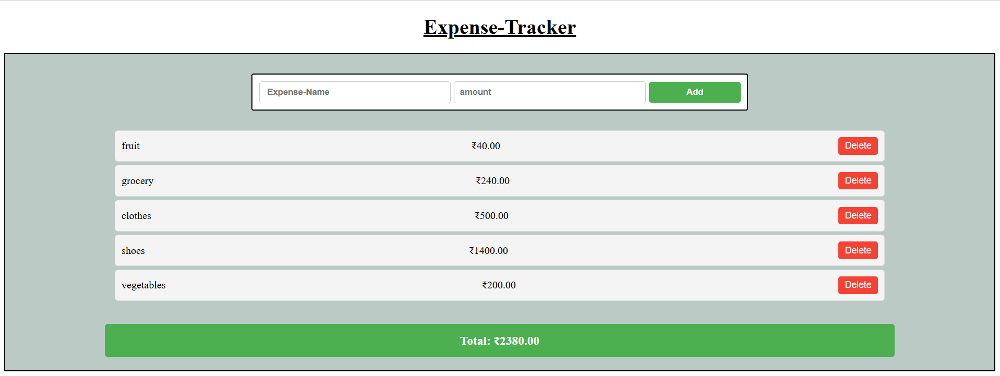

# 💰 Expense Tracker

A simple and intuitive expense tracking application built with vanilla JavaScript. Track your daily expenses, view real-time totals, and manage your budget effectively.

## 🚀 Live Demo

**[View Live Demo]((https://expense-tracker-woad-zeta.vercel.app)


## 📸 Screenshots

  
*(Replace with actual screenshot after deployment)*

## ✨ Features

- ✅ Add expenses with name and amount
- ✅ View real-time total of all expenses
- ✅ Delete individual expenses
- ✅ Data persists using localStorage (survives page refresh)
- ✅ Responsive design for mobile and desktop
- ✅ Input validation to prevent invalid entries
- ✅ Clean and intuitive user interface

## 🛠️ Technologies Used

- **HTML5** - Structure and semantic markup
- **CSS3** - Styling with Flexbox layout
- **JavaScript (ES6+)** - Core functionality and DOM manipulation
- **localStorage API** - Client-side data persistence

## 💻 How to Run Locally

1. Clone the repository
```bash
   git clone https://github.com/YOUR-USERNAME/expense-tracker.git
```

2. Navigate to the project directory
```bash
   cd expense-tracker
```

3. Open `index.html` in your browser
```bash
   # On Windows
   start index.html
   
   # On Mac
   open index.html
   
   # Or simply double-click the index.html file
```

## 📝 How It Works

1. **Add Expense**: Enter expense name and amount, then click "Add"
2. **View Total**: See your total expenses updated in real-time
3. **Delete Expense**: Click the "Delete" button on any expense to remove it
4. **Persistent Storage**: All expenses are saved automatically and persist across browser sessions

## 🎯 Key Learnings

Through building this project, I learned:
- Managing application state with vanilla JavaScript
- Working with localStorage for data persistence
- DOM manipulation and event handling
- Input validation and error handling
- Building responsive layouts with CSS Flexbox
- Creating a clean and intuitive user interface

## 🔮 Future Enhancements

- [ ] Add expense categories (Food, Transport, Entertainment, etc.)
- [ ] Filter expenses by category
- [ ] Add date tracking for each expense
- [ ] Export expenses to CSV
- [ ] Monthly expense charts and analytics
- [ ] Edit existing expenses
- [ ] Dark mode toggle

## 👤 Author

**Satish Kumar**

- 📧 Email: satishrana8791@gmail.com
- 💼 LinkedIn: [linkedin.com/in/satish-kumar8791](https://linkedin.com/in/satish-kumar8791)
- 🐙 GitHub: [@satish-kumar8791](https://github.com/satish-kumar8791)
- 💻 LeetCode: [satish-kumar8791](https://leetcode.com/satish-kumar8791)

## 📄 License

This project is open source and available under the [MIT License](LICENSE).

## 🙏 Acknowledgments

- Built as part of my web development learning journey
- Inspired by the need for simple personal finance tracking

---

⭐ If you found this project helpful, please consider giving it a star on GitHub!
